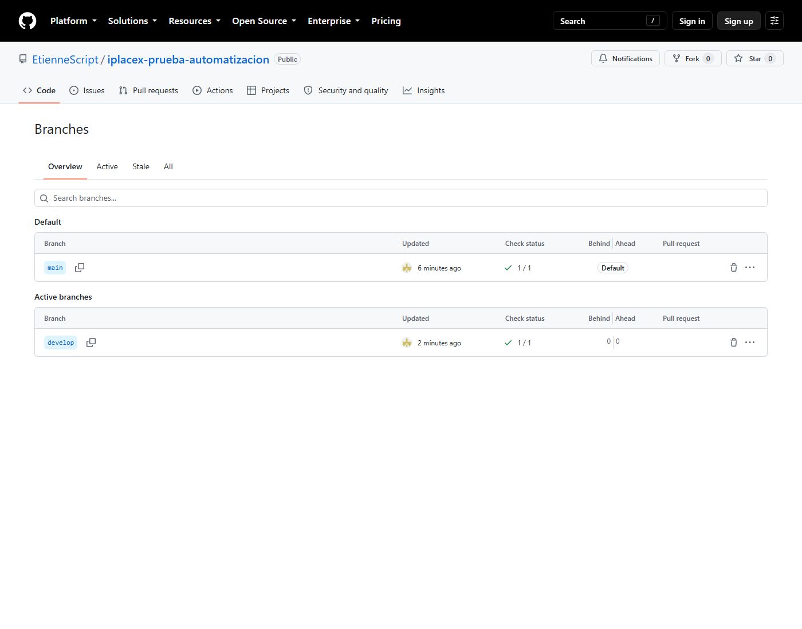
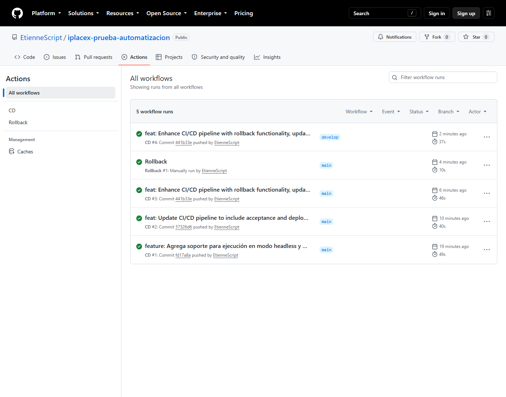
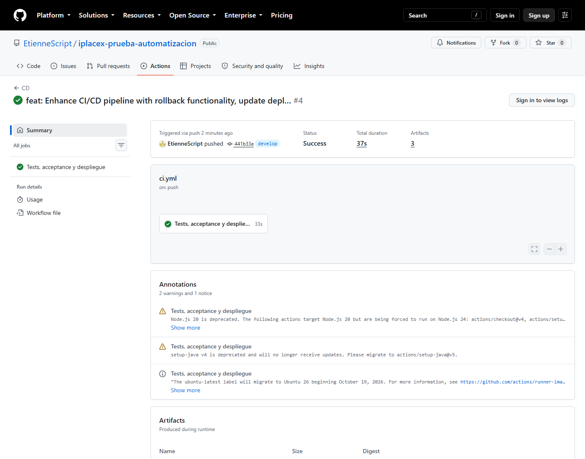
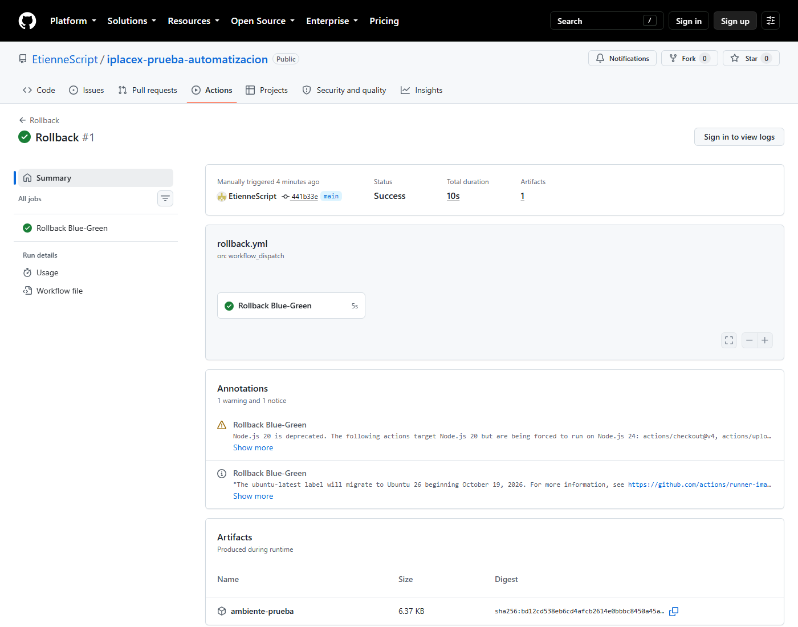
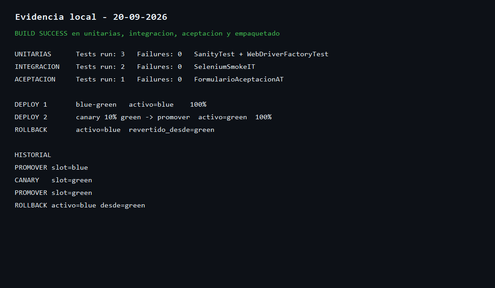

# Iplacex — Prueba de automatización

Proyecto de **integración continua y despliegue continuo** para el curso de automatización: repositorio Git con **GitFlow**, Maven (JUnit 5 + Selenium) y un pipeline que compila, prueba, acepta y despliega en un ambiente de prueba con **Blue-Green, canary y rollback**.

Repositorio: [github.com/EtienneScript/iplacex-prueba-automatizacion](https://github.com/EtienneScript/iplacex-prueba-automatizacion)

## Descripción

El entregable no es una aplicación de negocio, sino un **laboratorio de CI/CD**:

- El código vive en `main` (producción) y `develop` (integración), según GitFlow.
- Maven construye el JAR y ejecuta tres capas de prueba.
- GitHub Actions (también Jenkins y GitLab) corre **Tests → Acceptance → Despliegue**.
- El ambiente de prueba es simulado (`ambiente-prueba/`), con dos slots (`blue` / `green`).

## Estrategia de pruebas

Se usa una pirámide corta, cada capa con un plugin y un criterio distinto:

| Capa | Qué valida | Cómo | Archivos |
| --- | --- | --- | --- |
| **Unitarias** | Lógica local, sin red ni navegador | Surefire (`mvn test`) | `*Test.java` |
| **Integración** | El navegador abre el formulario de Selenium y escribe un campo | Failsafe (`*IT`) | `SeleniumSmokeIT` |
| **Aceptación** | Criterio de negocio: el usuario envía el formulario y ve `Received!` | Failsafe (`*AT`) | `FormularioAceptacionAT` |

- Las unitarias (`SanityTest`, `WebDriverFactoryTest`) fallan rápido y no dependen de Chrome.
- Integración y aceptación usan Chrome headless (Selenium Manager descarga el driver).
- En el pipeline, si las unitarias o la integración fallan, **no** se corre acceptance ni el despliegue.

## Cómo ejecutar las pruebas

Requisitos: JDK 17, Google Chrome y el wrapper Maven (`.\mvnw.cmd` en PowerShell).

```powershell
.\mvnw.cmd test
.\mvnw.cmd verify -DskipUnitTests=true -DskipATs=true
.\mvnw.cmd verify -DskipUnitTests=true -DskipITs=true
```

| Tipo | Comando |
| --- | --- |
| Unitarias | `.\mvnw.cmd test` |
| Integración | `.\mvnw.cmd verify -DskipUnitTests=true -DskipATs=true` |
| Aceptación | `.\mvnw.cmd verify -DskipUnitTests=true -DskipITs=true` |
| Ver el navegador | agrega `-Dheadless=false` |

## Cómo ejecutar los pipelines

El mismo flujo está versionado en tres formatos. En GitHub se dispara solo:

| Archivo | Dónde corre | Cómo se lanza |
| --- | --- | --- |
| `.github/workflows/ci.yml` | GitHub Actions (CD) | Push a `main`, `develop` o ramas GitFlow |
| `.github/workflows/rollback.yml` | GitHub Actions | Actions → **Rollback** → Run workflow |
| `Jenkinsfile` | Jenkins | Pipeline from SCM; `ACCION=desplegar` o `rollback` |
| `.gitlab-ci.yml` | GitLab CI/CD | Push; el job `rollback-prueba` es **manual** |

Stages del CD: **Build → Tests → Acceptance → Despliegue Blue-Green**.

Despliegue y rollback en local (después de empaquetar):

```powershell
.\mvnw.cmd -DskipUnitTests=true -DskipITs=true -DskipATs=true package
.\scripts\desplegar-ambiente-prueba.ps1
.\scripts\desplegar-ambiente-prueba.ps1
.\scripts\rollback-ambiente-prueba.ps1
```

El primer deploy activa `blue` al 100%. El segundo hace canary 10% en `green` y luego promueve a 100%. El rollback devuelve el tráfico a `blue`.

Guía de ramas: [`docs/flujo-de-ramas.md`](docs/flujo-de-ramas.md).

## Evidencias de funcionamiento

### GitFlow: `main` y `develop` en GitHub



### Pipeline CD en verde (unitarias, integración, acceptance y deploy)





### Rollback Blue-Green en verde



Runs públicos:

- [CD #4 en `develop`](https://github.com/EtienneScript/iplacex-prueba-automatizacion/actions/runs/35541684395) (success, 37 s)
- [Rollback #1](https://github.com/EtienneScript/iplacex-prueba-automatizacion/actions/runs/35541576291) (success, 10 s)

### Corrida local: pruebas + canary + Blue-Green + rollback


